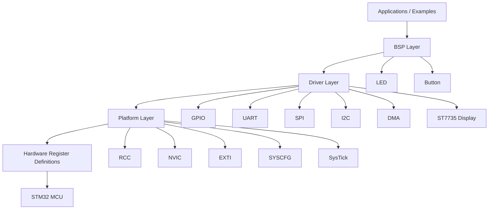

# stm32-baremetal-drivers

Bare-metal peripheral drivers for the STM32L4 (Nucleo-L452RE-P), written without HAL or CMSIS. Every driver goes straight to the hardware registers.

**Target:** STM32L452RE, Cortex-M4 @ 16 MHz (HSI16), 512K Flash, 128K RAM  
**Toolchain:** `arm-none-eabi-gcc`, OpenOCD + ST-Link  

---

## Repository layout

```
stm32-baremetal-drivers/
├── drivers/
│   ├── gpio/           GPIO, mode, speed, pull, AF, BSRR atomic writes
│   ├── uart/           USART, polling or interrupt-driven TX/RX (ring buffers), USART1/2
│   ├── i2c/            I2C master, 100 kHz, analog + digital filter
│   ├── spi/            SPI master, full CR1/CR2 config, blocking transfer, see docs/spi.md
│   ├── st7735-display/ ST7735 128x128 SPI LCD: init sequence, FillScreen, DrawImage
│   └── dma/            DMA, planned
├── platform/
├── hw/
├── startup/
├── examples/
├── tests/
├── Makefile
├── Dockerfile
├── linker.ld
└── .github/workflows/
```

## Architecture



## Major subsystems

- GPIO: [drivers/gpio/README.md](drivers/gpio/README.md)
- UART: [drivers/uart/README.md](drivers/uart/README.md)
- SPI: [drivers/spi/README.md](drivers/spi/README.md)
- I2C: [drivers/i2c/README.md](drivers/i2c/README.md)
- DMA: [drivers/dma/README.md](drivers/dma/README.md)
- ST7735 display: [drivers/st7735-display/README.md](drivers/st7735-display/README.md)

## Documentation

- GPIO: [docs/gpio.md](docs/gpio.md)
- Architecture example: [docs/project-architecture.md](docs/project-architecture.md)
- UART docs: [docs/uart.md](docs/uart.md)
- SPI docs: [docs/spi.md](docs/spi.md)
- DMA docs: [docs/dma.md](docs/dma.md)
- LinkedIn post template: [docs/linkedin-project-post-template.md](docs/linkedin-project-post-template.md)
- Portfolio checklist: [docs/portfolio-checklist.md](docs/portfolio-checklist.md)

## Example projects

- 01_gpio-blink
- 02_button-interrupt
- 03_uart-cli
- 04_uart-interrupt
- 05_uart-polling
- 06_spi-loopback
- 07_spi-display-ST7735
- 08_spi-crc-loopback

## Build and test

Requirements:

- arm-none-eabi-gcc
- openocd
- picocom for serial console access
- cmocka for host tests
- lcov for coverage

Build all firmware targets:

```bash
cd examples/<name>   # 01_gpio-blink | 02_button-interrupt | etc
make
make flash
```

Requirements: `picocom` to use any of the uart-* examples

```bash
ls /dev/tty*
picocom --b 115200 /dev/ttyACM0
```


Connect via any serial terminal at **115200 8N1** on the ST-Link virtual COM port.

---

## Running unit tests locally

Quick steps to build and run the host unit tests for the GPIO driver:

Build and run unit tests 

Requirements: `cmocka`

```bash
make ut
```

Generate coverage:

```bash
make coverage
```

Run cppcheck and formatting checks through CI:

```bash
cppcheck --enable=all --suppress=missingInclude --suppress=missingIncludeSystem .
```

