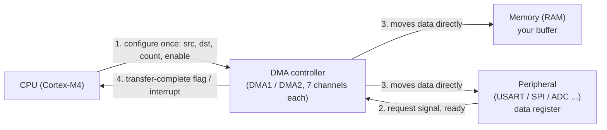
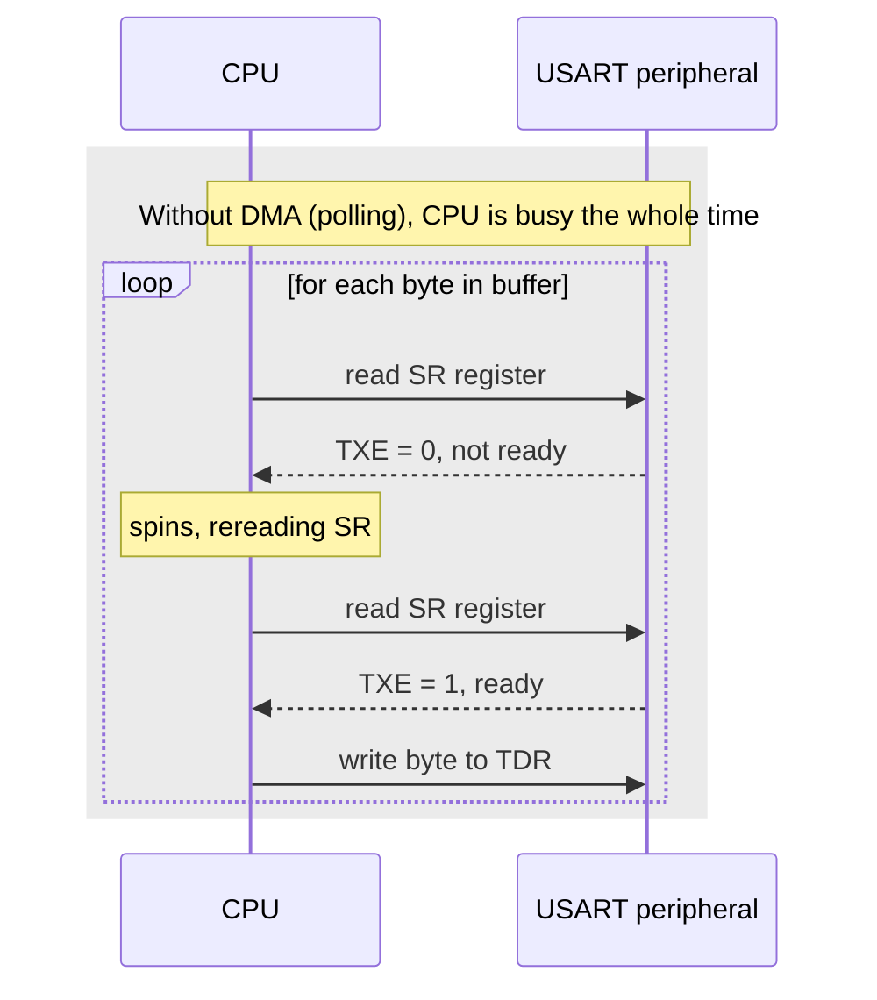
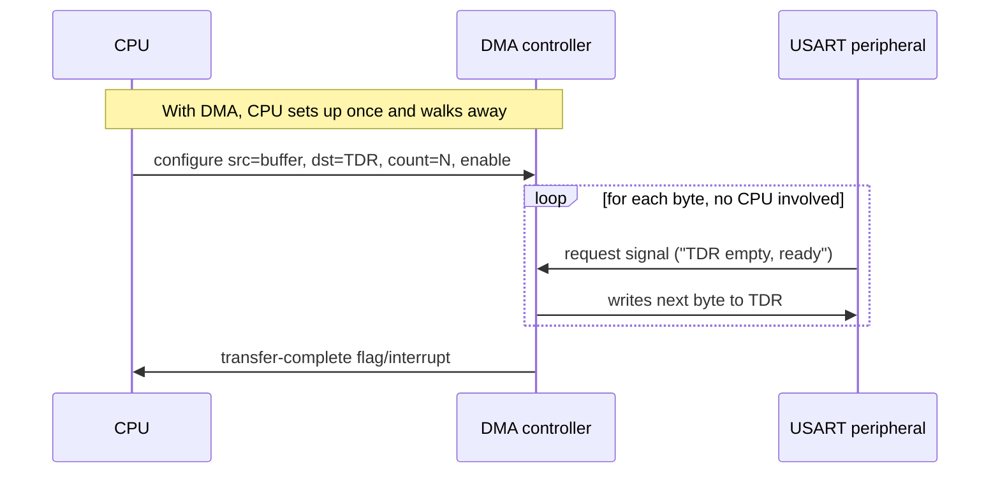

# Direct memory access (DMA)

Bare-metal DMA driver for the STM32L452RE (Cortex-M4). **Status: planned**, see [README](../README.md). This doc currently covers the hardware concept only; it will grow into a full architecture/API reference (same shape as [`docs/spi.md`](spi.md) / [`docs/uart.md`](uart.md)) once `drivers/dma/` exists.

---

## 1. What it is

Without DMA, the CPU is the only thing that can move a byte between a peripheral's data register and RAM. It has to personally notice "the peripheral is ready" (by polling a flag, or via an interrupt) and then execute the load/store itself, one byte at a time.

DMA is a separate hardware block, the **DMA controller**, sitting on the bus right alongside the CPU and every peripheral. You give it a source address, a destination address, and a count. It then moves the data itself, with no CPU instructions executed per byte, and tells you when it's done.

The CPU only touches step 1, setting the transfer up once. Steps 2 and 3 happen entirely between the peripheral and the DMA controller; the CPU isn't involved until step 4, when it's told the whole thing is finished.

---

## 2. Without DMA vs. with DMA

Same job (send a buffer over UART), two very different amounts of CPU involvement:

The peripheral's "ready" flag (`TXE`, `RXNE`, etc.) still exists either way. The only thing that changes is *who's listening to it*, the CPU (poll/interrupt) or the DMA controller (request line).

---

## 3. Vocabulary

| Term | Plain-English meaning |
|---|---|
| DMA controller | The DMA hardware block itself (`DMA1`, `DMA2`). Not software, a peripheral like any other, needs its clock enabled via RCC before use. |
| Channel | One of 7 independent "workers" per controller. Each channel runs one transfer at a time, several channels can run simultaneously. |
| Request / `CSELR` | Each channel needs to be told *which* peripheral's request line it's wired to (e.g. USART2 TX vs SPI1 RX). This is a mux setting, not automatic. |
| `CNDTR` | Count register: how many data units are left to transfer. Counts down to 0. |
| `CPAR` / `CMAR` | Peripheral address / memory address registers, the "from" and "to" of the transfer. |
| Circular mode | Instead of stopping at count 0, the channel wraps back to the start and keeps going forever, used for continuous sampling (e.g. ADC into a ring buffer). |
| Mem2mem | No peripheral at all, just RAM-to-RAM copy. No request line needed since nothing is waiting on a peripheral flag; the simplest possible DMA transfer to test the controller itself. |

---

## 4. First test project

`examples/09_dma-memcpy` (planned): DMA1 Channel1 in mem2mem mode, copies a source buffer to a destination buffer, then compares them and blinks the LED on match. No peripheral, no wiring, isolates the DMA engine itself (`CCR`/`CNDTR`/`CPAR`/`CMAR`, enable, completion flag) before bringing `CSELR`/peripheral-request complexity into the picture.
