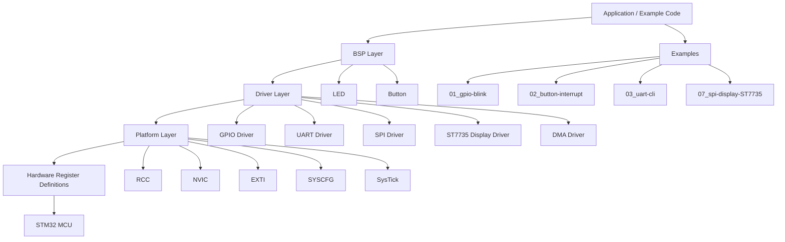

# Project Architecture

## Overview

This architecture describes the `stm32-baremetal-drivers` project and shows how hardware access, board logic, and application code are separated into clear layers.

## Layer responsibilities

### 1. Application / Example code

This is where the project demonstrates specific use cases such as blinking an LED, reading a button interrupt, driving a UART CLI, or updating a display.

### 2. BSP layer

Board support code provides the mapping from abstract concepts like LED and button to concrete STM32 pins.

Examples:

- LED on PB13
- user button on PC13

### 3. Driver layer

Each driver owns one hardware domain:

- GPIO: pin config and state transitions
- UART: serial RX/TX, ring buffers, interrupts
- SPI: full-duplex byte transfers and device selection
- ST7735: LCD init and framebuffer writes
- DMA: memory-to-memory and peripheral transfers

### 4. Platform layer

This layer provides MCU services that are not tied to one specific peripheral but support the whole system:

- clock management via RCC
- interrupt masking and priorities via NVIC
- external interrupt routing via EXTI and SYSCFG
- timing via SysTick

### 5. Hardware register layer

This is the lowest layer of the design and contains the raw memory-mapped register definitions and base addresses. It is intentionally thin and directly reflects the STM32 reference manual.
