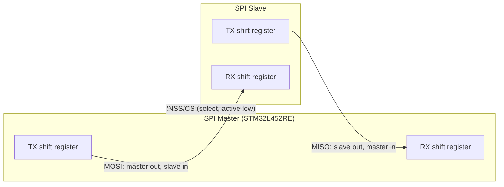

# Serial peripheral interface (SPI)

Bare-metal SPI driver for STM32L452RE (Cortex-M4).

Source: 

---


---

## 1. Overview

Full-duplex is the default SPI mode: MOSI and MISO are independent lines, both active on every clock edge, so the master and slave shift a bit out and shift a bit in *simultaneously* — a "transfer" is really two one-directional transfers happening at once, driven by one shared clock.



Each `SCK` edge shifts one bit out of `MTX` onto `MOSI` (captured into `SRX`) **and** one bit out of `STX` onto `MISO` (captured into `MRX`), at the same time. Neither side has to wait for the other to finish — after 8 clock edges, the master has both sent a byte and received a byte, in the time it takes to send one.

SPI works by taking data from the Tx FIFO, shifting it out bit-by-bit on MOSI while simultaneously receiving bits on MISO into the Rx FIFO, all synchronized by the SCK clock.
```code

           SEND
CPU -> Tx FIFO -> Shift Register -> MOSI

           RECEIVE
CPU <- Rx FIFO <- Shift Register <- MISO

Clock (SCK) controls the timing.
NSS selects the device.

```

---