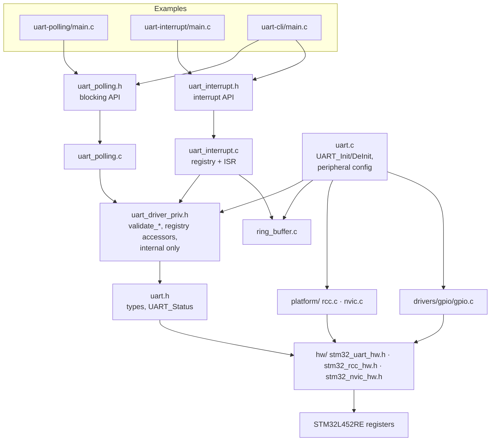
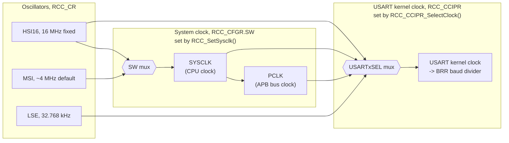
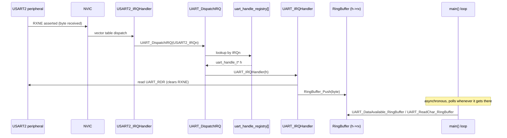
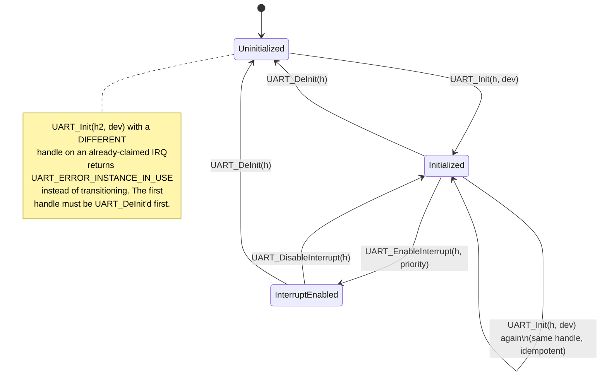

# UART Driver

Bare-metal USART driver for the STM32L452RE (Cortex-M4). Polling or interrupt-driven TX/RX, both directions ring-buffered when interrupt-driven, no HAL/CMSIS. Supports USART1 and USART2.

Source: [`drivers/uart/`](../drivers/uart/) · Examples: [`uart-polling/`](../examples/uart-polling/) · [`uart-interrupt/`](../examples/uart-interrupt/) · [`uart-cli/`](../examples/uart-cli/)

---

## 1. Overview

| Feature | Status |
|---|---|
| TX | Both: blocking (`UART_WriteByteRaw`) or interrupt-driven via a ring buffer (`TXEIE`) |
| RX | Interrupt-driven, fed into a per-handle ring buffer |
| Instances | USART1, USART2 (registry has reserved slots for USART3/LPUART1, not wired, see [§9](#9-known-limitations)) |
| Word length | 7 / 8 / 9 bits |
| Parity | None / Even / Odd |
| Stop bits | 1 / 0.5 / 2 / 1.5 |
| Clock source (per instance) | PCLK / SYSCLK / HSI16 / LSE, via `RCC_CCIPR` |
| Multi-instance safety | IRQ→handle registry rejects claiming an IRQ already owned by a different handle |

---

## 2. Where it sits

The driver is split by concern into three public units plus one internal one. Application code never touches the internal one directly:



Nothing in `drivers/uart/` touches a register that isn't declared in `hw/`, and nothing here makes clock/GPIO decisions that belong to `platform/`/`drivers/gpio/`. It composes them. `uart_driver_priv.h` exists because `UART_validate_handle`/`UART_validate_device` and the IRQ→handle registry accessors are needed by more than one of the three `.c` files. Putting them there instead of in the public headers keeps application code from seeing internal plumbing it has no business calling.

---

## 3. Clock architecture

This is the part that's easy to get wrong (and did, during development): **the CPU's system clock and a UART's kernel clock are two independent muxes that happen to both offer "HSI16" as an option.**



**Why bypass PCLK?** Selecting `HSI16` or `LSE` directly for a UART's kernel clock means its baud rate stays fixed no matter what the CPU is doing with `SYSCLK` (e.g. power-mode frequency scaling), and `LSE` specifically keeps the UART alive in STOP mode for wakeup-on-RX. `BOARD_UART2` uses `RCC_CLK_HSI16` for exactly the first reason. Its baud rate is independent of whatever `RCC_SetSysclk()` picks for the core.

`RCC_GetClockSourceFreq()` resolves this to a real Hz value for the baud-rate math, but only for the two hardware-fixed sources:

| `RCC_ClockSource` | Frequency | Why |
|---|---|---|
| `RCC_CLK_HSI16` | 16,000,000 Hz | Fixed internal RC oscillator |
| `RCC_CLK_LSE` | 32,768 Hz | Standard watch-crystal assumption |
| `RCC_CLK_PCLK` | **0** | Runtime-variable (SYSCLK ÷ APB prescaler), not tracked |
| `RCC_CLK_SYSCLK` | **0** | Runtime-variable, not tracked |

Selecting `PCLK`/`SYSCLK` today will divide-by-zero in `UART_set_baudrate`. Avoid them until that tracking exists.

---

## 4. Word length & parity, the M1/M0/PCE gotcha

The STM32 `M` bits set the **total frame size**, not "data bits plus a bonus parity bit." Enabling parity on an 8-bit word steals the MSB for parity instead of adding a 9th bit. This caused real garbled output during development.

| M1 | M0 | PCE | Actual frame | Driver config |
|:--:|:--:|:--:|---|---|
| 0 | 0 | 0 | 8 data, no parity | `UART_WORD_LENGTH_8B` + `UART_PARITY_NONE` |
| 0 | 0 | 1 | **7 data** + 1 parity | `UART_WORD_LENGTH_8B` + parity enabled, only 7 real data bits reach you |
| 0 | 1 | 0 | 9 data, no parity | `UART_WORD_LENGTH_9B` + `UART_PARITY_NONE` |
| 0 | 1 | 1 | **8 data** + 1 parity | `UART_WORD_LENGTH_9B` + `UART_PARITY_EVEN`/`ODD`, the correct pairing for real 8-bit-plus-parity |
| 1 | 0 | 0 | 7 data, no parity | `UART_WORD_LENGTH_7B` + `UART_PARITY_NONE` |
| 1 | 0 | 1 | 6 data + 1 parity | `UART_WORD_LENGTH_7B` + parity enabled |

If you want 8 real data bits *with* parity, you must set `UART_WORD_LENGTH_9B`, not `_8B`. The receiving terminal must also be configured to match (e.g. 8-O-1), or it'll misinterpret the parity bit as data.

---

## 5. Interrupt-driven RX

### 5.1 Registry, how an ISR finds its handle

There's no per-instance hardcoded `USART2_IRQHandler` reaching into a global by name. `UART_Init` registers the handle in a small array indexed by IRQn; the ISR looks it up generically.



If the ring buffer is full when a byte arrives, `UART_IRQHandler` reads and discards it (`RDR` must be read regardless, or `RXNE` never clears and the ISR fires forever).

### 5.2 Instance lifecycle



`UART_DeInit` disables the interrupt, disables the peripheral (`UE`), clears the handle's registry slot (only if it still points at that exact handle), and nulls `h->dev` so any further use of a torn-down handle fails validation instead of touching dead hardware state.

**Handle lifetime contract:** a handle passed to `UART_Init` must have static or global storage duration. The registry keeps its address and the ISR dereferences it at any time until `UART_DeInit`. A stack-local handle becomes a dangling pointer the moment its function returns.

---

## 6. Ring buffer

Generic single-producer/single-consumer byte ring buffer ([`ring_buffer.h`](../drivers/uart/include/ring_buffer.h)), used for both `h->rx` and `h->tx`. Roles are mirrored: for `rx` the ISR is the producer (push) and the main loop the consumer (pop); for `tx` the main loop is the producer (`UART_WriteChar_RingBuffer` pushes) and the ISR is the consumer (pops and writes `TDR` on each `TXEIE`+`TXE`). Either way, exactly one side ever writes `head` and the other only `tail`, which is what keeps it safe without disabling interrupts.

```
                 tail                    head
                  ↓                       ↓
  buffer:  [ B ][ C ][ D ][ . ][ . ][ . ][ . ][ A ]
             ↑                              (next Push lands here,
        (next Pop reads this)                then head advances)

  Push: buffer[head] = byte; head = (head + 1) % RING_BUFFER_SIZE   (no-op if full)
  Pop:  byte = buffer[tail]; tail = (tail + 1) % RING_BUFFER_SIZE   (fails if empty)

  Empty  when head == tail
  Full   when (head + 1) % RING_BUFFER_SIZE == tail   (one slot always kept empty)
```

`head` is only ever written by the producer (the ISR), `tail` only by the consumer (main-loop code). That split is what makes it safe without disabling interrupts around every access.

---

## 7. API reference

### Lifecycle, `uart.h` / `uart.c`
| Function | Purpose |
|---|---|
| `UART_Init(h, dev)` | Clock + GPIO + peripheral bring-up, registers `h` for its IRQ |
| `UART_DeInit(h)` | Disable interrupt + peripheral, unregister, invalidate `h` |

### Low-level (blocking register access), `uart_polling.h` / `uart_polling.c`
| Function | Purpose |
|---|---|
| `UART_WriteByteRaw(h, c)` | Block on `TXE`, write one byte |
| `UART_ReadByteRaw(h, c)` | Block on `RXNE`, read one byte |

### Polling transfer layer, `uart_polling.h` / `uart_polling.c`
| Function | Purpose |
|---|---|
| `UART_PollWriteChar(h, c)` | Alias for `UART_WriteByteRaw` |
| `UART_PollWriteString(h, s)` | Write a NUL-terminated string, blocking |
| `UART_PollReadChar(h, c)` | Alias for `UART_ReadByteRaw` |
| `UART_ReadCharEcho(h, c)` | Blocking read + echo the byte back |
| `UART_PollReadString(h, buf, max)` | Blocking read-with-echo until `\r`/`\n` |

### Interrupt-driven layer, `uart_interrupt.h` / `uart_interrupt.c`
| Function | Purpose |
|---|---|
| `UART_EnableInterrupt(h, priority)` | Enable `RXNEIE` + NVIC for `h`'s IRQ |
| `UART_DisableInterrupt(h)` | Disable `RXNEIE` *and* `TXEIE` + NVIC |
| `UART_IRQHandler(h)` | Generic ISR body, services RX and TX, called via the registry, not directly |

### Non-blocking RX read (ring buffer filled by the ISR), `uart_interrupt.h` / `uart_interrupt.c`
| Function | Purpose |
|---|---|
| `UART_DataAvailable_RingBuffer(h, &n)` | Bytes currently buffered |
| `UART_ReadChar_RingBuffer(h, &c)` | Pop one byte, `'\0'` if none available |
| `UART_ReadString_RingBuffer(h, buf, max)` | Drain up to a terminator, see [§9 caveat](#9-known-limitations) |

### Non-blocking TX write (ring buffer drained by the ISR), `uart_interrupt.h` / `uart_interrupt.c`
| Function | Purpose |
|---|---|
| `UART_WriteChar_RingBuffer(h, c)` | Queue one byte, enables `TXEIE` to (re)start draining |
| `UART_WriteString_RingBuffer(h, s)` | Queue a NUL-terminated string the same way |

---

## 8. Examples

Three examples, each demonstrating one concept, smallest to most complete:

- **[`uart-polling/`](../examples/uart-polling/)**, `uart_polling.h` only. Blocking write, blocking read-with-echo until `\r`/`\n`, blocking write-back. No interrupts; the main loop is parked on hardware flags the whole time.
- **[`uart-interrupt/`](../examples/uart-interrupt/)**, `uart_interrupt.h` only. RX and TX both interrupt-driven: characters are echoed live as they arrive, and on `\r`/`\n` the accumulated line is echoed back as a whole (via a persistent index across main-loop iterations, see the [§9 caveat](#9-known-limitations) on why a plain `UART_ReadString_RingBuffer` call can't do this on its own).
- **[`uart-cli/`](../examples/uart-cli/)**, a real mini-application built on top of the interrupt API: same line-accumulation pattern, but dispatches `"LED ON"`/`"LED OFF"` commands instead of just echoing.

From [`examples/uart-cli/main.c`](../examples/uart-cli/main.c):

```c
static uart_handle_t uart2_handle;

static const uart_device_t BOARD_UART2 = {
    .clk = {.bus = RCC_UART_BUS_APB1,
            .enr = {.apb1 = RCC_APB1ENR1_USART2},
            .clk_sel = RCC_SEL_USART2,
            .clk_src = RCC_CLK_HSI16},
    .uart = {
        .base = USART2_BASE,
        .irq = USART2_IRQn,
        .word_length = UART_WORD_LENGTH_8B,
        .parity = UART_PARITY_NONE,
        .stop_bits = UART_STOP_1,
        .baudrate = 115200,
        .tx = {.port = GPIO_PORT_A, .pin = PIN_2, .mode = GPIO_MODE_AF, .af = AF_7},
        .rx = {.port = GPIO_PORT_A, .pin = PIN_3, .mode = GPIO_MODE_AF, .af = AF_7}}};

static int string_equal(const char *a, const char *b) {
    while (*a && *b) {
        if (*a != *b) return 0;
        a++; b++;
    }
    return (*a == '\0' && *b == '\0');
}

int main(void) {
    RCC_SetSysclk(RCC_SYSCLK_HSI16);           // board clock bring-up, once

    UART_Init(&uart2_handle, &BOARD_UART2);
    UART_EnableInterrupt(&uart2_handle, IRQ_PRIO_1);
    UART_PollWriteString(&uart2_handle, "UART READY\r\n");

    /* ... LED_Init ... */

    enum { CMD_MAX_LEN = 32 };
    char cmd[CMD_MAX_LEN];
    int idx = 0;

    while (1) {
        int available = 0;
        UART_DataAvailable_RingBuffer(&uart2_handle, &available);

        while (available-- > 0) {
            char c;
            UART_ReadChar_RingBuffer(&uart2_handle, &c);
            UART_WriteByteRaw(&uart2_handle, c);   // live echo (blocking TX here)

            if (c == '\r' || c == '\n') {
                cmd[idx] = '\0';
                idx = 0;

                if (string_equal(cmd, "LED ON"))  { LED_On(&led_cfg);  }
                if (string_equal(cmd, "LED OFF")) { LED_Off(&led_cfg); }
            } else if (idx < CMD_MAX_LEN - 1) {
                cmd[idx++] = c;
            }
        }
    }
}
```

---

## 9. Known limitations

- **USART3/LPUART1 are registry slots, not real support.** `UART_RegistryIndex` and the vector table both reserve space for them, but `UART_validate_device` still only whitelists `USART1_BASE`/`USART2_BASE`, and `USART3_BASE` isn't even defined in `stm32_uart_hw.h` yet. `UART_Init` will reject either today.
- **`PCLK`/`SYSCLK` as a UART clock source is a footgun.** `RCC_GetClockSourceFreq` returns `0` for both (see [§3](#3-clock-architecture)), which divides-by-zero the baud-rate calculation. Only `HSI16`/`LSE` are safe to select until real bus-frequency tracking exists.
- **`UART_ReadString_RingBuffer` can't accumulate across calls.** It restarts its index at 0 every call, so if a full line hasn't arrived in the ring buffer yet, it terminates early instead of waiting. It only works correctly if you know the whole line is already buffered. The `uart-cli` example works around this by draining char-by-char with its own persistent index instead of calling this function.
- **Blocking and interrupt-driven TX must not be mixed on the same handle at the same time.** Both `UART_WriteByteRaw` and the interrupt-driven TX path (`UART_WriteChar_RingBuffer` / the ISR) drive the same `TDR` register. Queue a write via the ring buffer and let it fully drain before making a blocking write on the same handle, or vice versa. Interleaving them races for the register.
- **No overrun/parity/framing error handling.** `UART_ISR` only exposes `RXNE`/`TC`/`TXE`. `ORE`/`PE`/`FE` aren't defined or checked, so a receiver overrun (ISR falling behind) or a parity mismatch is silently ignored rather than recovered from.
