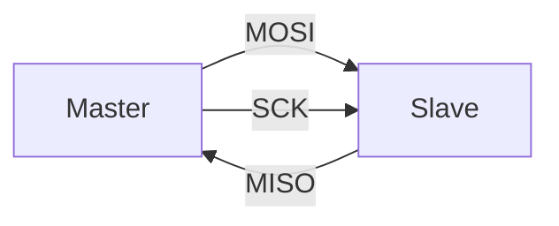

# SPI Driver

## Overview

The SPI driver implements a bare-metal master-mode serial interface for STM32 devices. It is designed for direct register programming and is used to communicate with peripheral chips such as displays, sensors, and external memory.

## Why it matters

SPI is widely used in embedded systems because it is:

- simple to understand,
- fast for short data transfers,
- easy to route with few wires,
- useful for LCD panels, ADCs, sensors, and memory devices.

This project uses SPI, for example, to drive the ST7735 display and to validate loopback communication.

## Core responsibilities

The driver handles:

- clock configuration and baud rate selection,
- GPIO mapping for MOSI, MISO, SCK, and NSS,
- full-duplex byte transfer,
- CRC configuration support,
- device selection and deselection via chip select.

## Key API

```c
SPI_Status SPI_Config(const spi_dev_t *dev);
void SPI_Select(const spi_dev_t *dev);
void SPI_Deselect(const spi_dev_t *dev);
uint8_t SPI_TransferByte(const spi_dev_t *dev, uint8_t data);
```

This API is intentionally compact, making it easy to integrate into drivers and application code while avoiding heavy abstraction.

## SPI behavior

SPI is inherently full-duplex. When the master writes a byte, it simultaneously receives a byte from the slave. This is an important point for embedded design because a transfer is not strictly “send-only” or “receive-only”; each byte exchanged is bidirectional.



## Example usage

```c
SPI_Config(&display_spi);
SPI_Select(&display_spi);
uint8_t rx = SPI_TransferByte(&display_spi, 0xA5);
SPI_Deselect(&display_spi);
```

## Design trade-offs

The project prioritizes clarity and correctness over broad feature coverage. The driver currently focuses on proven full-duplex blocking transfers, which is a strong foundation for more advanced DMA and interrupt support later.

This is a good engineering trade-off for a portfolio project because the implemented mode is reliable and easy to explain, rather than trying to cover every peripheral mode at once.

## Limitations to document in a portfolio

Some SPI features are intentionally not yet expanded:

- interrupt-driven transfers
- DMA support
- multi-byte buffer helpers
- advanced error recovery for overruns and mode faults
